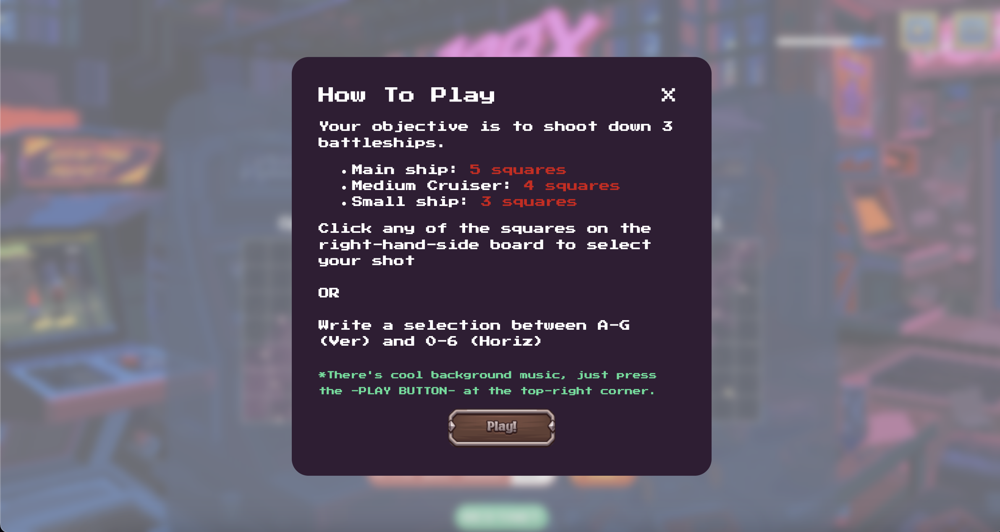
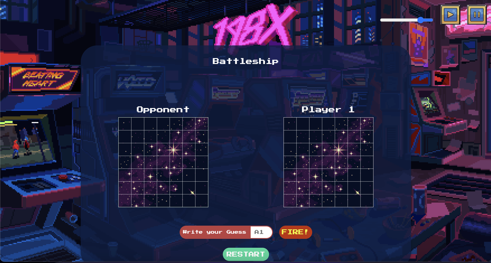
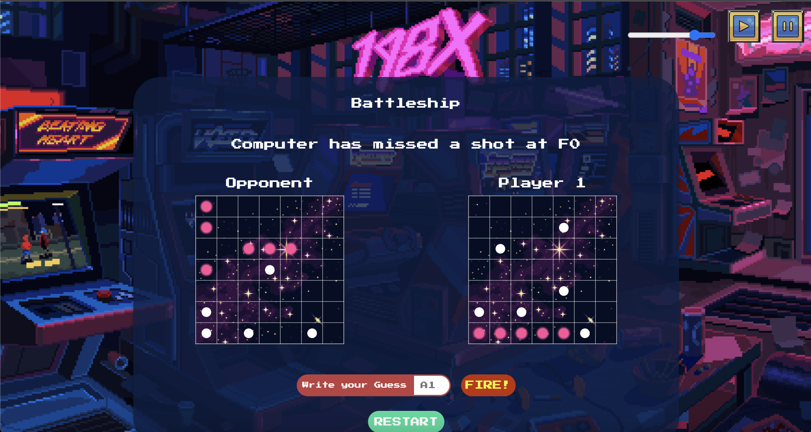
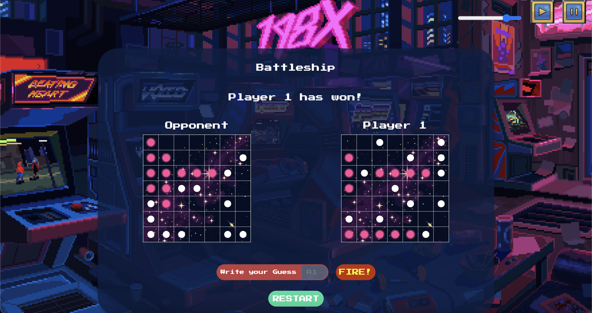

# :ocean:  BattleshipGame 

## Description:
A retro arcade themed Battleship Game built with its own opponent. This game was my first General Assembly Software Engineering Immersive project. The game includes background music with a How-To-Play manual. In addition, the computer opponent includes advanced logic to beat the player if they are not careful.

## Below: The Wireframe of the Game


## Technologies Used:


## Getting Started
:video_game: How-To-Play: There are *THREE* ships on the board. The main ship takes up 5 squares. Medium ship takes 4 squares. The small ship takes up 3 spaces. The board is 7x7 squares. 

The objetive is to sink all of the ships before the opponent, which can be difficult without a strategy. 
There's background music for an immersive arcade experience! 
And most important of all, don't forget to have fun!
:joystick: [Live Link](https://andrewsegovia00.github.io/BattleshipGame/).
## Game Screenshots:

### Below: The instruction manual once the page loads


### Below: The state of the game before the first move


### Below: The state during the Mid-Game


### Below: The End-Game state


## Code Snippet
```javascript
function handleCellClick(event) {
    const target = event.target;
    const guessValue = target.id;
    userBoard.disabled = true;
    userBoard.removeEventListener(`click`, handleCellClick);
    let compGuess = computerGuess();

    handleGuess(guessValue, firstShip, secondShip, thirdShip);
    turn *= -1;
    if(firstShip.sunk && secondShip.sunk && thirdShip.sunk )
    {
        return;
    }

    setTimeout( () => {
        handleGuess(compGuess, computerFirstShip, computerSecondShip, computerThirdShip);
        turn *= -1;
        userBoard.disabled = false;
        userBoard.addEventListener(`click`, handleCellClick);
    }, 750);

    if(computerFirstShip.sunk && computerSecondShip.sunk && computerThirdShip.sunk)
    {
        return;
    }
}
```
This code snippet showcases the handleCellClick function which is responsible for managing the game flow when a user clicks on a cell. It retrieves the user's guess and temporarily disables the board from further clicks triggering the function. The function then generates the computer's guess and checks if all the computer's ships have been sunk. If so, the function returns.

Next it calls the upon the handleGuess function to render the board and the state of the game, if all of the user's ships have been sunk, the function returns. It then set a timeout to give the appearance that the computer took time to make it's move. It then renders the computer's guess through the handleGuess function.

In summary, the handleCellClick function ensures the proper handling of user's and computer's guesses, updates the game state accordingly, and manages the turns between the user and the computer.

## Future Features: 
- [ ] Refine the AI logic to introduce different difficulty modes, such as a challenging hard mode and a beginner-friendly easy mode.
- [ ] Implement a player naming function and incorporate a timer to track and display high scores, showcasing how quickly each player defeats different difficulty levels.
- [ ] Enhance the game experience by incorporating sound effects that mimic the impact of a ship being hit.
- [ ] Optimize the game board by increasing its size
- [ ] Ensure compatibility with mobile devices by incorporating responsive design techniques, allowing players to enjoy the game seamlessly on various screen sizes.